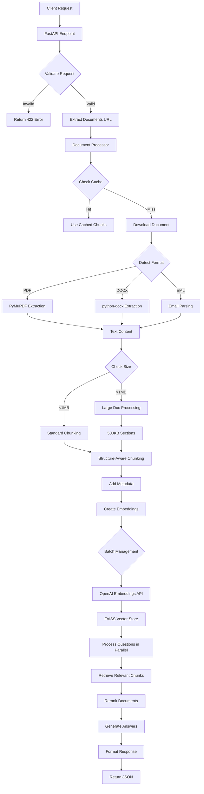
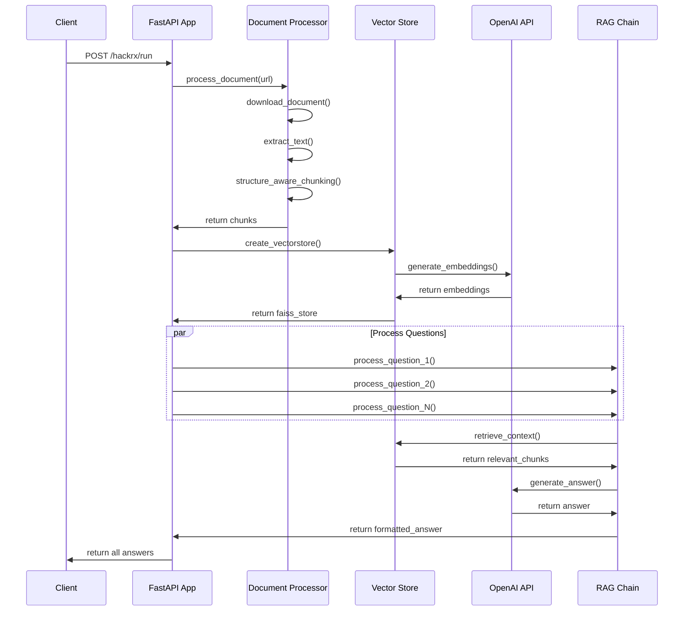

# Architecture Documentation

## System Overview

The Advanced Document Q&A System is a sophisticated RAG (Retrieval-Augmented Generation) pipeline built with modern AI technologies. This document provides a comprehensive overview of the system architecture, design patterns, and implementation details.

## Table of Contents

- [High-Level Architecture](#high-level-architecture)
- [Component Architecture](#component-architecture)
- [Data Flow](#data-flow)
- [Processing Pipeline](#processing-pipeline)
- [Performance Optimizations](#performance-optimizations)
- [Design Patterns](#design-patterns)
- [Technology Stack](#technology-stack)
- [Scalability Considerations](#scalability-considerations)

## High-Level Architecture

```
┌─────────────────────────────────────────────────────────────────────────────┐
│                           Client Applications                               │
│  ┌─────────────┐  ┌─────────────┐  ┌─────────────┐  ┌─────────────┐        │
│  │   Web App   │  │ Mobile App  │  │   API CLI   │  │  Postman    │        │
│  └─────────────┘  └─────────────┘  └─────────────┘  └─────────────┘        │
└─────────────────────────────────────────────────────────────────────────────┘
                                       │
                                HTTP/HTTPS
                                       │
┌─────────────────────────────────────────────────────────────────────────────┐
│                              FastAPI Gateway                                │
│  ┌─────────────────────────────────────────────────────────────────────────┐ │
│  │                        /hackrx/run Endpoint                            │ │
│  │  • Request Validation   • Authentication   • Rate Limiting             │ │
│  │  • Error Handling      • Response Formatting                           │ │
│  └─────────────────────────────────────────────────────────────────────────┘ │
└─────────────────────────────────────────────────────────────────────────────┘
                                       │
                                   Internal API
                                       │
┌─────────────────────────────────────────────────────────────────────────────┐
│                         Document Processing Layer                           │
│  ┌─────────────┐  ┌─────────────┐  ┌─────────────┐  ┌─────────────┐        │
│  │  Document   │  │    Text     │  │  Structure  │  │   Metadata  │        │
│  │ Downloader  │  │ Extractor   │  │   Chunker   │  │ Enrichment  │        │
│  └─────────────┘  └─────────────┘  └─────────────┘  └─────────────┘        │
│         │                 │                 │                 │            │
│    PDF, DOCX, EML    PyMuPDF, docx    Smart Chunking    Source URLs        │
└─────────────────────────────────────────────────────────────────────────────┘
                                       │
                                  Processed Chunks
                                       │
┌─────────────────────────────────────────────────────────────────────────────┐
│                           Vector Processing Layer                           │
│  ┌─────────────┐  ┌─────────────┐  ┌─────────────┐  ┌─────────────┐        │
│  │   OpenAI    │  │   Batching  │  │    FAISS    │  │  Similarity │        │
│  │ Embeddings  │  │  Strategy   │  │ Vector DB   │  │   Search    │        │
│  └─────────────┘  └─────────────┘  └─────────────┘  └─────────────┘        │
│         │                 │                 │                 │            │
│   text-embedding    Token Management    Index Building    k-NN Search      │
│     -3-small                                                               │
└─────────────────────────────────────────────────────────────────────────────┘
                                       │
                                 Relevant Chunks
                                       │
┌─────────────────────────────────────────────────────────────────────────────┐
│                        Question Processing Layer                            │
│  ┌─────────────┐  ┌─────────────┐  ┌─────────────┐  ┌─────────────┐        │
│  │   Parallel  │  │  Context    │  │  Document   │  │   Answer    │        │
│  │ Processing  │  │ Retrieval   │  │  Reranking  │  │ Generation  │        │
│  └─────────────┘  └─────────────┘  └─────────────┘  └─────────────┘        │
│         │                 │                 │                 │            │
│  ThreadPoolExecutor   Vector Search    LLM Scoring     GPT-4o-mini        │
└─────────────────────────────────────────────────────────────────────────────┘
                                       │
                                 Generated Answers
                                       │
┌─────────────────────────────────────────────────────────────────────────────┐
│                           External Services                                 │
│  ┌─────────────┐  ┌─────────────┐  ┌─────────────┐  ┌─────────────┐        │
│  │   OpenAI    │  │  Document   │  │   Internet  │  │   Caching   │        │
│  │     API     │  │   Hosts     │  │ Connectivity│  │   Layer     │        │
│  └─────────────┘  └─────────────┘  └─────────────┘  └─────────────┘        │
│         │                 │                 │                 │            │
│   Chat & Embeddings    PDF/DOCX URLs    HTTP/HTTPS      LRU Cache         │
└─────────────────────────────────────────────────────────────────────────────┘
```

## Component Architecture

### 1. FastAPI Application Layer (`app.py`)

**Responsibilities:**
- HTTP request/response handling
- Input validation and sanitization
- Error handling and logging
- Response formatting
- Authentication (placeholder)

**Key Components:**
```python
# FastAPI app initialization
app = FastAPI(
    title="Advanced Document Q&A System",
    description="RAG-based document question answering"
)

# Main endpoint implementation
@app.post("/hackrx/run", response_model=HackathonOutput)
async def run_submission(request: HackathonInput)
```

**Design Patterns:**
- **Dependency Injection**: Environment configuration
- **Factory Pattern**: Vector store creation
- **Strategy Pattern**: Different processing modes (fast/thorough)

### 2. Document Processing Layer (`document_processor.py`)

**Architecture:**
```
Document URL → Download → Format Detection → Text Extraction → Chunking → Metadata
```

**Key Functions:**

#### Text Extraction Pipeline
```python
def _extract_text_from_pdf(file_path: str) -> str
def _extract_text_from_docx(file_path: str) -> str  
def _extract_text_from_eml(file_path: str) -> str
```

#### Smart Chunking Algorithm
```python
def structure_aware_chunking(text: str) -> List[Tuple[str, str]]:
    """
    Intelligent text chunking that preserves document structure
    
    Algorithm:
    1. Detect section headers using regex patterns
    2. Split by sections first
    3. Further split large sections by paragraphs
    4. Maintain section header context
    5. Optimize chunk sizes for embeddings
    """
```

#### Large Document Handling
```python
def process_large_document(text_content: str, document_url: str, file_name: str) -> List:
    """
    Process documents >1MB in manageable sections
    
    Strategy:
    - Split into 500KB sections
    - Process each section independently  
    - Maintain section numbering
    - Preserve metadata across sections
    """
```

### 3. Vector Store Management

**FAISS Integration Architecture:**
```
Document Chunks → Token Estimation → Batch Creation → Embedding Generation → Index Building
```

**Batching Strategy:**
```python
def create_vectorstore_with_batched_embeddings(chunked_documents, embeddings_model):
    """
    Smart batching to handle OpenAI token limits
    
    Algorithm:
    1. Estimate tokens per document chunk
    2. Group chunks into batches (200K token limit)
    3. Create initial FAISS index from first batch
    4. Incrementally add remaining batches
    5. Handle token limit errors with sub-batching
    """
```

### 4. RAG Chain Implementation (`rag_chain.py`)

**Pipeline Architecture:**
```
Question → Context Retrieval → Prompt Engineering → LLM Generation → Answer Optimization
```

**Key Components:**

#### Context Retrieval
```python
def get_context_fast(question: str) -> str:
    """
    Optimized context retrieval
    
    Process:
    1. Invoke vector store retrieval
    2. Limit to top 6 documents for speed
    3. Extract section headers from metadata
    4. Truncate content to 800 characters
    5. Format with numbered references
    """
```

#### Prompt Engineering
```python
fast_prompt = ChatPromptTemplate.from_template("""
    Answer the question based on the policy content below. 
    Be direct and concise (1-2 sentences).

    POLICY CONTENT:
    {context}

    QUESTION: {question}

    ANSWER:""")
```

### 5. Schema Management (`schemas.py`)

**Data Models:**
```python
# API Interface Models
class HackathonInput(BaseModel):
    documents: str  # Document URL
    questions: List[str]  # List of questions

class HackathonOutput(BaseModel):
    answers: List[str]  # Corresponding answers

# Internal Processing Models  
class ParsedQuery(BaseModel):
    procedure: Optional[str]
    entities: List[str]

class FinalAnswer(BaseModel):
    answer: str
```

## Data Flow

### Complete Request Processing Flow



### Document Processing Flow



## Processing Pipeline

### 1. Document Ingestion Pipeline

```
┌─────────────┐    ┌─────────────┐    ┌─────────────┐    ┌─────────────┐
│   URL Input │───▶│  Download   │───▶│   Format    │───▶│    Text     │
│             │    │  Document   │    │  Detection  │    │ Extraction  │
└─────────────┘    └─────────────┘    └─────────────┘    └─────────────┘
                           │                   │                   │
                   HTTP Request        File Extension      Format-specific
                   Error Handling      MIME Type Check     Text Processing

┌─────────────┐    ┌─────────────┐    ┌─────────────┐    ┌─────────────┐
│   Chunked   │◀───│  Structure  │◀───│ Large Doc   │◀───│  Raw Text   │
│ Documents   │    │   Analysis  │    │  Handling   │    │   Content   │
└─────────────┘    └─────────────┘    └─────────────┘    └─────────────┘
        │                   │                   │                   │
   With Metadata    Section Headers      500KB Sections      Cleaned Text
   Ready for ML     Paragraph Breaks     Memory Management   Error Handling
```

### 2. Vector Processing Pipeline

```
┌─────────────┐    ┌─────────────┐    ┌─────────────┐    ┌─────────────┐
│  Document   │───▶│   Token     │───▶│   Batch     │───▶│  OpenAI     │
│   Chunks    │    │ Estimation  │    │ Creation    │    │ Embeddings  │
└─────────────┘    └─────────────┘    └─────────────┘    └─────────────┘
        │                   │                   │                   │
   Text Content      3 chars/token      200K token limit    API Calls
   Metadata          Conservative       Smart grouping      Rate limiting

┌─────────────┐    ┌─────────────┐    ┌─────────────┐    ┌─────────────┐
│    FAISS    │◀───│   Vector    │◀───│ Embedding   │◀───│   Vector    │
│   Index     │    │   Store     │    │ Vectors     │    │ Response    │
└─────────────┘    └─────────────┘    └─────────────┘    └─────────────┘
        │                   │                   │                   │
  Similarity Search    Index Building     1536 dimensions     JSON Format
  k-NN Algorithm      Memory Efficient    Normalized         Error Handling
```

### 3. Question Processing Pipeline

```
┌─────────────┐    ┌─────────────┐    ┌─────────────┐    ┌─────────────┐
│  Questions  │───▶│  Parallel   │───▶│   Vector    │───▶│  Retrieved  │
│    List     │    │ Processing  │    │   Search    │    │  Documents  │
└─────────────┘    └─────────────┘    └─────────────┘    └─────────────┘
        │                   │                   │                   │
   User Input        ThreadPoolExecutor    Similarity Match     Top-k Results
   Validation        Worker Management     Distance Scoring     Relevance Order

┌─────────────┐    ┌─────────────┐    ┌─────────────┐    ┌─────────────┐
│  Generated  │◀───│    LLM      │◀───│  Context    │◀───│  Document   │
│   Answers   │    │ Generation  │    │ Assembly    │    │  Reranking  │
└─────────────┘    └─────────────┘    └─────────────┘    └─────────────┘
        │                   │                   │                   │
   Final Response      GPT-4o-mini       Prompt Template    LLM Scoring
   JSON Format         API Call          Context Injection   Quality Filter
```

## Performance Optimizations

### 1. Caching Strategy

```python
# Document processing cache
@lru_cache(maxsize=10)
def build_knowledge_base_from_urls(document_url: str) -> List
```

**Benefits:**
- Eliminates redundant document processing
- Reduces API calls to OpenAI
- Improves response times for repeated documents
- Memory-efficient with LRU eviction

### 2. Parallel Processing Architecture

```python
# Dynamic worker allocation
if len(chunked_documents) > 2000:
    max_workers = 3  # More workers for large docs
elif len(request.questions) > 3:
    max_workers = 4  # More workers for many questions  
else:
    max_workers = 2  # Fewer workers for small sets

with ThreadPoolExecutor(max_workers=max_workers) as executor:
    # Process questions concurrently
```

**Optimization Strategy:**
- **CPU-bound tasks**: Parallel question processing
- **I/O-bound tasks**: Concurrent API calls
- **Memory management**: Dynamic worker allocation
- **Load balancing**: Adaptive resource allocation

### 3. Token Management System

```python
def estimate_tokens(text):
    """Conservative token estimation: 3 chars per token"""
    return max(1, len(text) // 3)

# Batch creation with token limits
MAX_TOKENS_PER_BATCH = 200_000  # Stay below OpenAI's 300k limit
```

**Benefits:**
- Prevents API errors from token overflow
- Optimizes embedding batch sizes
- Reduces API call overhead
- Handles large documents gracefully

### 4. Smart Chunking Algorithm

```python
def structure_aware_chunking(text: str) -> List[Tuple[str, str]]:
    # 1. Detect structural elements
    header_patterns = [
        r'^[A-Z][A-Z\s]{10,}$',  # ALL CAPS headers
        r'^\d+\.\s+[A-Z]',        # Numbered sections  
        r'^[A-Z][a-z\s]{5,}:$'    # Title case with colon
    ]
    
    # 2. Preserve context with headers
    # 3. Optimize chunk sizes (1500 chars)
    # 4. Handle large sections intelligently
```

**Advantages:**
- Maintains document structure
- Preserves semantic boundaries  
- Optimizes for embedding quality
- Handles various document formats

## Design Patterns

### 1. Factory Pattern - Vector Store Creation

```python
def create_vectorstore_with_batched_embeddings(chunked_documents, embeddings_model):
    """Factory method for creating optimized vector stores"""
    # Dynamic strategy selection based on document size
    # Handles different batching strategies
    # Manages error recovery and fallbacks
```

### 2. Strategy Pattern - Processing Modes

```python
# Fast mode for large datasets
fast_mode = len(request.questions) > 3 or len(chunked_documents) > 1000

if fast_mode:
    top_docs = docs[:6]  # Skip reranking
else:
    reranked_docs = rerank_chunks(question, docs, llm=llm_rerank)
    top_docs = reranked_docs[:6]
```

### 3. Template Method Pattern - RAG Pipeline

```python
def fast_rag_logic(inputs):
    # 1. Extract question
    question = inputs["question"]
    
    # 2. Retrieve context (template method)
    context = get_context_fast(question)
    
    # 3. Generate answer (template method)
    chain = fast_prompt | llm | StrOutputParser()
    answer = chain.invoke({"context": context, "question": question})
    
    # 4. Post-process answer (template method)
    return optimize_answer(answer)
```

### 4. Observer Pattern - Error Handling

```python
try:
    vectorstore = create_vectorstore_with_batched_embeddings(chunked_documents, embeddings_model)
except Exception as e:
    # Graceful error handling with fallbacks
    raise HTTPException(status_code=500, detail=f"Error processing document: {str(e)}")
```

## Technology Stack

### Core Technologies

| Component | Technology | Version | Purpose |
|-----------|------------|---------|---------|
| **Web Framework** | FastAPI | 0.116+ | HTTP API, validation, documentation |
| **ASGI Server** | Uvicorn | 0.35+ | Production ASGI server |
| **AI Framework** | LangChain | 0.3.27+ | RAG pipeline orchestration |
| **Language Model** | OpenAI GPT-4o-mini | Latest | Answer generation |
| **Embeddings** | OpenAI text-embedding-3-small | Latest | Vector representations |
| **Vector Database** | FAISS | 1.12+ | Similarity search |
| **PDF Processing** | PyMuPDF | 1.26+ | PDF text extraction |
| **DOCX Processing** | python-docx | 1.2+ | Word document processing |
| **Data Validation** | Pydantic | 2.11+ | Schema validation |
| **Environment** | python-dotenv | 1.1+ | Configuration management |

### Dependencies Graph

```
FastAPI
├── Pydantic (data validation)
├── Uvicorn (ASGI server)
└── Starlette (web framework)

LangChain
├── OpenAI (language models)
├── FAISS (vector store)
├── Text Splitters (chunking)
└── Document Loaders

Document Processing  
├── PyMuPDF (PDF)
├── python-docx (Word)
├── email (EML parsing)
└── requests (HTTP)

Utilities
├── python-dotenv (config)
├── typing (type hints)
└── asyncio (async support)
```

## Scalability Considerations

### Horizontal Scalability

#### Load Balancing Strategy
```
┌─────────────┐    ┌─────────────┐    ┌─────────────┐
│   Client    │───▶│    Load     │───▶│  FastAPI    │
│  Requests   │    │  Balancer   │    │  Instance 1 │
└─────────────┘    │  (nginx)    │    └─────────────┘
                   │             │    ┌─────────────┐
                   │             │───▶│  FastAPI    │
                   │             │    │  Instance 2 │
                   │             │    └─────────────┘
                   │             │    ┌─────────────┐
                   │             │───▶│  FastAPI    │
                   └─────────────┘    │  Instance N │
                                      └─────────────┘
```

#### Stateless Design
- **No server state**: Each request is independent
- **Cache externalization**: Redis or Memcached for shared cache
- **Database offloading**: Persistent vector store (Pinecone, Weaviate)

### Vertical Scalability

#### Resource Optimization
```python
# Memory management
MAX_WORKERS = min(4, os.cpu_count())
CHUNK_SIZE = 1500  # Optimize for memory vs. context
BATCH_SIZE = calculate_optimal_batch_size()

# CPU optimization  
async def process_requests_async():
    # Non-blocking I/O for OpenAI API calls
    # Parallel processing for CPU-bound tasks
```

#### Performance Monitoring
```python
import time
import psutil

def monitor_performance():
    start_time = time.time()
    memory_usage = psutil.Process().memory_info().rss / 1024 / 1024  # MB
    cpu_usage = psutil.cpu_percent()
    
    # Log metrics for monitoring
    logger.info(f"Processing time: {time.time() - start_time:.2f}s")
    logger.info(f"Memory usage: {memory_usage:.2f}MB")
    logger.info(f"CPU usage: {cpu_usage:.1f}%")
```

### Database Scalability

#### Vector Store Options

| Solution | Pros | Cons | Use Case |
|----------|------|------|----------|
| **FAISS (Current)** | Fast, local, no network | Not persistent, single node | Development, small scale |
| **Pinecone** | Managed, scalable, persistent | Cost, vendor lock-in | Production, high scale |
| **Weaviate** | Open source, GraphQL API | Self-hosted complexity | Enterprise, custom needs |
| **Qdrant** | High performance, filters | Newer ecosystem | High performance needs |

#### Migration Strategy
```python
# Abstract vector store interface
class VectorStoreInterface:
    def similarity_search(self, query: str, k: int) -> List[Document]:
        pass
    
    def add_documents(self, documents: List[Document]) -> None:
        pass

class FAISSVectorStore(VectorStoreInterface):
    # Current implementation

class PineconeVectorStore(VectorStoreInterface):
    # Production implementation
```

### API Rate Limiting

#### Implementation Strategy
```python
from slowapi import Limiter
from slowapi.util import get_remote_address

limiter = Limiter(key_func=get_remote_address)
app.state.limiter = limiter

@app.post("/hackrx/run")
@limiter.limit("10/minute")  # 10 requests per minute per IP
async def run_submission(request: Request, payload: HackathonInput):
    # Processing logic
```

#### OpenAI Rate Limiting
```python
import openai
from tenacity import retry, stop_after_attempt, wait_exponential

@retry(
    stop=stop_after_attempt(3),
    wait=wait_exponential(multiplier=1, min=4, max=10)
)
async def call_openai_with_retry(prompt: str):
    # Automatic retry with exponential backoff
    return await openai.ChatCompletion.acreate(...)
```

## Security Architecture

### Current Security Model

#### Input Validation
```python
class HackathonInput(BaseModel):
    documents: HttpUrl  # Validates URL format
    questions: List[constr(min_length=1, max_length=500)]  # Length limits
    
    @validator('questions')
    def validate_question_count(cls, v):
        if len(v) > 10:
            raise ValueError('Maximum 10 questions allowed')
        return v
```

#### Error Handling
```python
# Sanitized error responses
try:
    result = process_document(url)
except Exception as e:
    logger.error(f"Processing error: {str(e)}")
    raise HTTPException(
        status_code=500, 
        detail="Error processing document"  # Generic message
    )
```

### Production Security Recommendations

#### Authentication & Authorization
```python
from fastapi.security import HTTPBearer
from jose import JWTError, jwt

security = HTTPBearer()

@app.post("/hackrx/run")
async def run_submission(
    request: HackathonInput,
    token: str = Depends(security)
):
    # Validate JWT token
    try:
        payload = jwt.decode(token, SECRET_KEY, algorithms=[ALGORITHM])
        user_id = payload.get("sub")
    except JWTError:
        raise HTTPException(status_code=401, detail="Invalid token")
```

#### Input Sanitization
```python
import bleach
from urllib.parse import urlparse

def validate_document_url(url: str) -> str:
    # Parse URL
    parsed = urlparse(url)
    
    # Validate scheme
    if parsed.scheme not in ['http', 'https']:
        raise ValueError("Only HTTP/HTTPS URLs allowed")
    
    # Validate domain (whitelist approach)
    allowed_domains = ['example.com', 'documents.company.com']
    if parsed.netloc not in allowed_domains:
        raise ValueError("Domain not allowed")
    
    return url

def sanitize_question(question: str) -> str:
    # Remove HTML tags and special characters
    return bleach.clean(question, tags=[], strip=True)
```

---

This architecture documentation provides a comprehensive overview of the system design, enabling developers to understand the implementation details and extend the system effectively. For implementation details, see the source code files, and for usage instructions, refer to the [README.md](./README.md) and [API_DOCUMENTATION.md](./API_DOCUMENTATION.md).