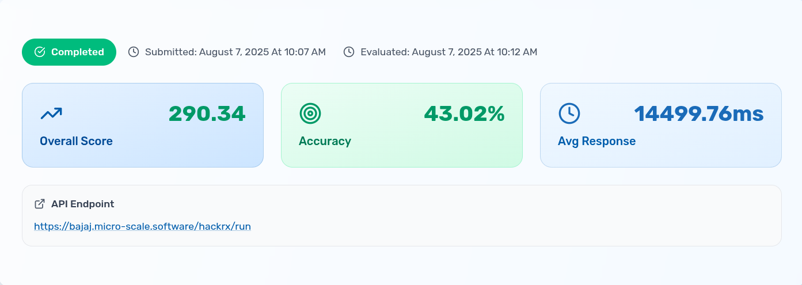

# Advanced Document Q&A System


A high-performance FastAPI-based document question-answering system that uses Retrieval-Augmented Generation (RAG) to answer questions based on document content. Built for the Bajaj Hackathon submission, this system processes multiple document formats and provides accurate, contextual answers using OpenAI's language models and FAISS vector database.

HackRx 6.0 – National Hackathon by Bajaj Finserv | Achieved Top **0.16%** rank among **46,000+** participants

## Features

- **Multi-Format Document Support**: Process PDF, DOCX, and EML files seamlessly
- **Intelligent Document Chunking**: Structure-aware text splitting for optimal context preservation
- **High-Performance Vector Search**: FAISS-powered similarity search for fast retrieval
- **Parallel Processing**: Concurrent question processing for improved throughput
- **Advanced RAG Pipeline**: Sophisticated retrieval and generation with reranking
- **Performance Optimizations**: Token management, batched embeddings, and caching
- **RESTful API**: Clean FastAPI interface with automatic documentation
- **Scalable Architecture**: Designed to handle large documents and multiple questions


## Table of Contents

- [Quick Start](#quick-start)
- [API Documentation](#api-documentation)
- [Architecture](#architecture)
- [Complete System Workflow](#complete-system-workflow)
- [Performance Features](#performance-features)
- [Evaluation Results](#evaluation-results)
- [Leaderboard Rank](#leaderboard-rank)


## Quick Start

1. **Clone the repository**
   ```bash
   git clone https://github.com/kartikjaiswal99/Bajaj_DOC_Q-A.git
   cd Bajaj_DOC_Q-A
   ```

2. **Install dependencies**
   ```bash
   uv pip install -r pyproject.toml
   ```

3. **Set up environment variables**
   ```bash
   echo "OPENAI_API_KEY=your_openai_api_key_here" > .env
   ```

4. **Run the server**
   ```bash
   python main_new.py
   # or
   uvicorn app:app --host 0.0.0.0 --port 8000 --reload
   ```

5. **Test the API**
   ```bash
   curl -X POST "http://localhost:8000/hackrx/run" \
   -H "Content-Type: application/json" \
   -d '{
     "documents": "https://example.com/document.pdf",
     "questions": ["What is the main topic of this document?"]
   }'
   ```

## API Documentation

### Main Endpoint

#### POST `/hackrx/run`

Processes documents and answers questions using the RAG pipeline.

**Request Body:**
```json
{
  "documents": "https://example.com/document.pdf",
  "questions": [
    "What is the main topic?",
    "Who are the key stakeholders?",
    "What are the important dates?"
  ]
}
```

**Response:**
```json
{
  "answers": [
    "The main topic is artificial intelligence in healthcare...",
    "The key stakeholders include doctors, patients, and AI researchers...",
    "Important dates include project start on January 2024..."
  ]
}
```

**Request Schema:**
- `documents` (string): URL of the document to process
- `questions` (array of strings): List of questions to answer

**Response Schema:**
- `answers` (array of strings): Corresponding answers to the questions

## Architecture

### Core Components

#### 1. Document Processor (`document_processor.py`)
- **Purpose**: Download, extract, and chunk documents
- **Supported Formats**: PDF, DOCX, EML
- **Key Features**:
  - Structure-aware chunking
  - Large document handling (500KB sections)
  - Metadata preservation
  - Caching with LRU cache

#### 2. RAG Chain (`rag_chain.py`)
- **Purpose**: Implement the retrieval-augmented generation pipeline
- **Components**:
  - Context retrieval
  - Prompt engineering
  - Answer generation
  - Response optimization

#### 3. Vector Store Management (`app.py`)
- **Purpose**: Manage FAISS vector database operations
- **Features**:
  - Batched embedding creation
  - Token limit management
  - Similarity search optimization
  - Document reranking

#### 4. API Layer (`app.py`)
- **Purpose**: FastAPI application with endpoints
- **Features**:
  - Request validation
  - Parallel processing
  - Error handling
  - Response formatting


## Complete System Workflow

```mermaid
graph TB
    %% Client Layer
    A[Client Application] --> B[HTTP POST Request]
    B --> C[FastAPI /hackrx/run Endpoint]
    
    %% Request Processing
    C --> D{Validate Input}
    D -->|Invalid| E[Return 422 Error]
    D -->|Valid| F[Extract Document URL & Questions]
    
    %% Document Processing Pipeline
    F --> G[Document Processor]
    G --> H{Check LRU Cache}
    H -->|Cache Hit| I[Use Cached Chunks]
    H -->|Cache Miss| J[Download Document]
    
    %% Document Download & Processing
    J --> K{Document Accessible?}
    K -->|No| L[Return 400 Error]
    K -->|Yes| M[Detect File Format]
    
    %% Format-Specific Processing
    M --> N{File Type?}
    N -->|PDF| O[PyMuPDF Text Extraction]
    N -->|DOCX| P[python-docx Extraction]
    N -->|EML| Q[Email Parser Extraction]
    N -->|Other| L
    
    %% Text Processing
    O --> R[Raw Text Content]
    P --> R
    Q --> R
    
    %% Size-Based Processing Strategy
    R --> S{Document Size Check}
    S -->|>1MB| T[Large Document Handler]
    S -->|≤1MB| U[Standard Processing]
    
    %% Large Document Processing
    T --> V[Split into 500KB Sections]
    V --> W[Process Each Section]
    W --> X[Structure-Aware Chunking]
    
    %% Standard Document Processing
    U --> X
    
    %% Chunking and Metadata
    X --> Y[Add Metadata to Chunks]
    Y --> Z[Store in Cache]
    Z --> I
    
    %% Vector Processing Pipeline
    I --> AA[Estimate Token Count]
    AA --> BB[Create Embedding Batches]
    BB --> CC{Batch Size OK?}
    CC -->|Too Large| DD[Split into Sub-batches]
    CC -->|OK| EE[Generate OpenAI Embeddings]
    DD --> EE
    
    %% Vector Store Creation
    EE --> FF[Create FAISS Vector Store]
    FF --> GG[Build Search Index]
    
    %% Question Processing
    GG --> HH[Initialize Parallel Processing]
    HH --> II{Determine Processing Mode}
    II -->|Large Dataset| JJ[Fast Mode - Skip Reranking]
    II -->|Small Dataset| KK[Thorough Mode - With Reranking]
    
    %% Parallel Question Processing
    JJ --> LL[Process Questions in Parallel]
    KK --> LL
    
    %% Individual Question Processing
    LL --> MM[For Each Question:]
    MM --> NN[Vector Similarity Search]
    NN --> OO[Retrieve Top-K Documents]
    OO --> PP{Reranking Mode?}
    PP -->|Fast| QQ[Use Top 6 Directly]
    PP -->|Thorough| RR[LLM-Based Reranking]
    
    %% Context Assembly
    QQ --> SS[Assemble Context]
    RR --> SS
    SS --> TT[Create Prompt with Context]
    
    %% Answer Generation
    TT --> UU[Send to OpenAI GPT-4o-mini]
    UU --> VV[Receive Generated Answer]
    VV --> WW[Post-process Answer]
    WW --> XX[Optimize Length & Format]
    
    %% Response Assembly
    XX --> YY[Collect All Answers]
    YY --> ZZ[Format JSON Response]
    ZZ --> AAA[Return to Client]
    
    %% Error Handling
    L --> BBB[Error Handler]
    E --> BBB
    BBB --> CCC[Log Error]
    CCC --> DDD[Return Error Response]
```




## Performance Features

### Optimization Strategies

1. **Parallel Processing**
   - Concurrent question processing using ThreadPoolExecutor
   - Dynamic worker allocation based on workload
   - No timeout constraints for natural completion

2. **Intelligent Caching**
   - LRU cache for document processing (maxsize=10)
   - Cached embeddings to avoid recomputation
   - Optimized vector store reuse

3. **Token Management**
   - Conservative token estimation (3 chars per token)
   - Batched embedding requests (200K token limit)
   - Automatic batch size adjustment

4. **Memory Optimization**
   - Large document sectioning (500KB chunks)
   - Efficient text processing
   - Minimal memory footprint

5. **Speed Optimizations**
   - Fast mode for large datasets
   - Reduced chunk sizes for speed
   - Optimized retrieval parameters


## Evaluation Results
<p align="center">
  
</p>
<p align="center"><b>Figure 1:</b> Model evaluation scores across metrics.</p>

## Leaderboard Rank
<p align="center">
  
</p>
<p align="center"><b>Figure 2:</b> Our team’s leaderboard position.</p>

## HackRx 6.0

This project is part of the HackRx 6.0 Bajaj Hackathon submission.
