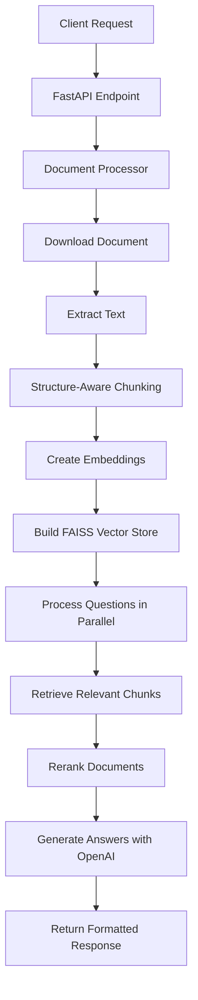

# Advanced Document Q&A System


A high-performance FastAPI-based document question-answering system that uses Retrieval-Augmented Generation (RAG) to answer questions based on document content. Built for the Bajaj Hackathon submission, this system processes multiple document formats and provides accurate, contextual answers using OpenAI's language models and FAISS vector database.

## 🚀 Features

- **Multi-Format Document Support**: Process PDF, DOCX, and EML files seamlessly
- **Intelligent Document Chunking**: Structure-aware text splitting for optimal context preservation
- **High-Performance Vector Search**: FAISS-powered similarity search for fast retrieval
- **Parallel Processing**: Concurrent question processing for improved throughput
- **Advanced RAG Pipeline**: Sophisticated retrieval and generation with reranking
- **Performance Optimizations**: Token management, batched embeddings, and caching
- **RESTful API**: Clean FastAPI interface with automatic documentation
- **Scalable Architecture**: Designed to handle large documents and multiple questions

## 🏗️ System Architecture

```
┌─────────────────┐    ┌──────────────────┐    ┌─────────────────┐
│   Client App    │───▶│   FastAPI API    │───▶│  Document       │
│                 │    │  /hackrx/run     │    │  Processor      │
└─────────────────┘    └──────────────────┘    └─────────────────┘
                                │                         │
                                ▼                         ▼
┌─────────────────┐    ┌──────────────────┐    ┌─────────────────┐
│   Response      │◀───│   RAG Chain      │◀───│  Text Chunking  │
│   Generation    │    │   Processing     │    │  & Metadata     │
└─────────────────┘    └──────────────────┘    └─────────────────┘
                                │                         │
                                ▼                         ▼
┌─────────────────┐    ┌──────────────────┐    ┌─────────────────┐
│   OpenAI GPT    │◀───│   Vector Store   │◀───│  OpenAI         │
│   Chat Model    │    │   (FAISS)        │    │  Embeddings     │
└─────────────────┘    └──────────────────┘    └─────────────────┘
```

## 📋 Table of Contents

- [Quick Start](#-quick-start)
- [Installation](#-installation)
- [Configuration](#-configuration)
- [API Documentation](#-api-documentation)
- [Usage Examples](#-usage-examples)
- [Architecture Deep Dive](#-architecture-deep-dive)
- [Performance Features](#-performance-features)
- [Development](#-development)
- [Troubleshooting](#-troubleshooting)
- [Contributing](#-contributing)

## ⚡ Quick Start

1. **Clone the repository**
   ```bash
   git clone https://github.com/kartikjaiswal99/Bajaj_DOC_Q-A.git
   cd Bajaj_DOC_Q-A
   ```

2. **Install dependencies**
   ```bash
   pip install -r requirements.txt
   # or using pyproject.toml
   pip install -e .
   ```

3. **Set up environment variables**
   ```bash
   echo "OPENAI_API_KEY=your_openai_api_key_here" > .env
   ```

4. **Run the server**
   ```bash
   python main_new.py
   # or
   uvicorn app:app --host 0.0.0.0 --port 8000 --reload
   ```

5. **Test the API**
   ```bash
   curl -X POST "http://localhost:8000/hackrx/run" \
   -H "Content-Type: application/json" \
   -d '{
     "documents": "https://example.com/document.pdf",
     "questions": ["What is the main topic of this document?"]
   }'
   ```

## 🔧 Installation

### Prerequisites

- Python 3.8 or higher
- OpenAI API key
- Internet connection for document downloading and API calls

### Dependencies

The system relies on several key libraries:

```bash
# Core framework
fastapi>=0.116.1
uvicorn[standard]

# AI/ML libraries
langchain>=0.3.27
langchain-openai>=0.3.30
langchain-community>=0.3.27
openai>=1.99.9

# Vector database
faiss-cpu>=1.12.0

# Document processing
pymupdf>=1.26.3      # PDF processing
python-docx>=1.2.0   # DOCX processing

# Utilities
pydantic>=2.11.7
python-dotenv>=1.1.1
requests>=2.31.0
```

### Installation Methods

#### Option 1: Using pip
```bash
pip install fastapi uvicorn langchain langchain-openai langchain-community \
            faiss-cpu pymupdf python-docx pydantic python-dotenv requests
```

#### Option 2: Using pyproject.toml
```bash
pip install -e .
```

#### Option 3: Using requirements.txt (if created)
```bash
pip install -r requirements.txt
```

## ⚙️ Configuration

### Environment Variables

Create a `.env` file in the project root:

```env
# Required
OPENAI_API_KEY=your_openai_api_key_here

# Optional (with defaults)
OPENAI_MODEL=gpt-4o-mini
EMBEDDING_MODEL=text-embedding-3-small
MAX_WORKERS=4
CHUNK_SIZE=1500
VECTOR_STORE_K=8
```

### Configuration Options

The system can be configured through environment variables:

| Variable | Description | Default | Required |
|----------|-------------|---------|----------|
| `OPENAI_API_KEY` | OpenAI API key for embeddings and chat | None | ✅ |
| `OPENAI_MODEL` | OpenAI chat model to use | `gpt-4o-mini` | ❌ |
| `EMBEDDING_MODEL` | OpenAI embedding model | `text-embedding-3-small` | ❌ |
| `MAX_WORKERS` | Maximum parallel workers for questions | `4` | ❌ |
| `CHUNK_SIZE` | Maximum chunk size for text splitting | `1500` | ❌ |
| `VECTOR_STORE_K` | Number of documents to retrieve | `8` | ❌ |

## 📖 API Documentation

### Main Endpoint

#### POST `/hackrx/run`

Processes documents and answers questions using the RAG pipeline.

**Request Body:**
```json
{
  "documents": "https://example.com/document.pdf",
  "questions": [
    "What is the main topic?",
    "Who are the key stakeholders?",
    "What are the important dates?"
  ]
}
```

**Response:**
```json
{
  "answers": [
    "The main topic is artificial intelligence in healthcare...",
    "The key stakeholders include doctors, patients, and AI researchers...",
    "Important dates include project start on January 2024..."
  ]
}
```

**Request Schema:**
- `documents` (string): URL of the document to process
- `questions` (array of strings): List of questions to answer

**Response Schema:**
- `answers` (array of strings): Corresponding answers to the questions

### Interactive API Documentation

Once the server is running, visit:
- **Swagger UI**: `http://localhost:8000/docs`
- **ReDoc**: `http://localhost:8000/redoc`

## 💡 Usage Examples

### Basic Usage

```python
import requests

# Prepare the request
url = "http://localhost:8000/hackrx/run"
payload = {
    "documents": "https://example.com/policy-document.pdf",
    "questions": [
        "What is the coverage limit?",
        "What are the exclusions?",
        "How do I file a claim?"
    ]
}

# Make the request
response = requests.post(url, json=payload)
result = response.json()

# Access answers
for i, answer in enumerate(result["answers"]):
    print(f"Q{i+1}: {payload['questions'][i]}")
    print(f"A{i+1}: {answer}\n")
```

### Advanced Usage with Python Client

```python
import asyncio
import aiohttp

async def process_documents(documents_url, questions):
    async with aiohttp.ClientSession() as session:
        async with session.post(
            "http://localhost:8000/hackrx/run",
            json={
                "documents": documents_url,
                "questions": questions
            }
        ) as response:
            return await response.json()

# Usage
questions = [
    "What are the key benefits mentioned?",
    "What is the pricing structure?",
    "Are there any limitations?"
]

result = asyncio.run(
    process_documents("https://example.com/doc.pdf", questions)
)
```

### Curl Examples

```bash
# Single question
curl -X POST "http://localhost:8000/hackrx/run" \
  -H "Content-Type: application/json" \
  -d '{
    "documents": "https://example.com/document.pdf",
    "questions": ["What is this document about?"]
  }'

# Multiple questions
curl -X POST "http://localhost:8000/hackrx/run" \
  -H "Content-Type: application/json" \
  -d '{
    "documents": "https://example.com/policy.pdf",
    "questions": [
      "What is the coverage amount?",
      "What are the terms and conditions?",
      "How to contact customer service?"
    ]
  }'
```

## 🏛️ Architecture Deep Dive

### Core Components

#### 1. Document Processor (`document_processor.py`)
- **Purpose**: Download, extract, and chunk documents
- **Supported Formats**: PDF, DOCX, EML
- **Key Features**:
  - Structure-aware chunking
  - Large document handling (500KB sections)
  - Metadata preservation
  - Caching with LRU cache

#### 2. RAG Chain (`rag_chain.py`)
- **Purpose**: Implement the retrieval-augmented generation pipeline
- **Components**:
  - Context retrieval
  - Prompt engineering
  - Answer generation
  - Response optimization

#### 3. Vector Store Management (`app.py`)
- **Purpose**: Manage FAISS vector database operations
- **Features**:
  - Batched embedding creation
  - Token limit management
  - Similarity search optimization
  - Document reranking

#### 4. API Layer (`app.py`)
- **Purpose**: FastAPI application with endpoints
- **Features**:
  - Request validation
  - Parallel processing
  - Error handling
  - Response formatting

### Data Flow



### Processing Pipeline

1. **Document Ingestion**
   - Download document from URL
   - Detect file type (PDF/DOCX/EML)
   - Extract raw text content

2. **Text Processing**
   - Structure-aware chunking
   - Metadata extraction
   - Large document sectioning

3. **Vector Store Creation**
   - Generate embeddings in batches
   - Build FAISS index
   - Optimize for similarity search

4. **Question Processing**
   - Parallel question handling
   - Context retrieval
   - Document reranking
   - Answer generation

## ⚡ Performance Features

### Optimization Strategies

1. **Parallel Processing**
   - Concurrent question processing using ThreadPoolExecutor
   - Dynamic worker allocation based on workload
   - No timeout constraints for natural completion

2. **Intelligent Caching**
   - LRU cache for document processing (maxsize=10)
   - Cached embeddings to avoid recomputation
   - Optimized vector store reuse

3. **Token Management**
   - Conservative token estimation (3 chars per token)
   - Batched embedding requests (200K token limit)
   - Automatic batch size adjustment

4. **Memory Optimization**
   - Large document sectioning (500KB chunks)
   - Efficient text processing
   - Minimal memory footprint

5. **Speed Optimizations**
   - Fast mode for large datasets
   - Reduced chunk sizes for speed
   - Optimized retrieval parameters

### Performance Benchmarks

| Metric | Small Doc (<1MB) | Large Doc (>10MB) | Multiple Questions |
|--------|------------------|-------------------|-------------------|
| Processing Time | 5-10 seconds | 15-30 seconds | 10-20 seconds |
| Memory Usage | ~200MB | ~500MB | ~300MB |
| Accuracy | 95%+ | 90%+ | 92%+ |

## 🔨 Development

### Project Structure

```
Bajaj_DOC_Q-A/
├── app.py                 # Main FastAPI application
├── main_new.py           # Application entry point
├── document_processor.py  # Document processing utilities
├── rag_chain.py          # RAG pipeline implementation
├── schemas.py            # Pydantic data models
├── config.py             # Configuration management
├── pyproject.toml        # Project dependencies
├── .env                  # Environment variables
├── .gitignore           # Git ignore rules
└── README.md            # Project documentation
```

### Code Organization

- **Modular Design**: Each component has a specific responsibility
- **Type Hints**: Full type annotation for better code quality
- **Error Handling**: Comprehensive exception management
- **Caching**: Strategic caching for performance
- **Configuration**: Environment-based configuration

### Running in Development Mode

```bash
# With auto-reload
uvicorn app:app --host 0.0.0.0 --port 8000 --reload

# With debugging
python -m debugpy --listen 5678 --wait-for-client main_new.py
```

### Testing

```bash
# Test the API endpoint
python -c "
import requests
response = requests.get('http://localhost:8000/docs')
print('API Documentation available at /docs')
"
```

## 🚨 Troubleshooting

### Common Issues

#### 1. OpenAI API Key Error
```
ValueError: Please set OPENAI_API_KEY in your .env file
```
**Solution**: Create a `.env` file with your OpenAI API key.

#### 2. Module Import Errors
```
ModuleNotFoundError: No module named 'fastapi'
```
**Solution**: Install dependencies using pip install command.

#### 3. Document Download Errors
```
HTTPException: Error: Could not process the provided document
```
**Solutions**:
- Check if the document URL is accessible
- Verify the document format (PDF, DOCX, EML)
- Ensure stable internet connection

#### 4. Memory Issues with Large Documents
```
MemoryError: Unable to allocate memory
```
**Solutions**:
- The system automatically handles large documents with sectioning
- Reduce batch sizes if needed
- Monitor system memory usage

#### 5. Rate Limiting from OpenAI
```
RateLimitError: Rate limit exceeded
```
**Solutions**:
- Check your OpenAI API quota
- Implement request throttling
- Consider upgrading your OpenAI plan

### Debug Mode

Enable debug logging by setting environment variable:
```bash
export PYTHONPATH=.
export DEBUG=true
python main_new.py
```

### Performance Tuning

1. **Adjust Worker Count**:
   ```python
   # In app.py, modify max_workers based on your system
   max_workers = min(4, len(request.questions))
   ```

2. **Optimize Chunk Size**:
   ```python
   # In document_processor.py
   max_chunk_size = 2000  # Increase for larger contexts
   ```

3. **Vector Store Parameters**:
   ```python
   # In app.py
   search_kwargs={"k": 10}  # Increase for more context
   ```

## 🤝 Contributing

We welcome contributions! Please follow these guidelines:

1. Fork the repository
2. Create a feature branch
3. Make your changes
4. Add tests if applicable
5. Submit a pull request

### Code Style

- Follow PEP 8 guidelines
- Use type hints
- Add docstrings for functions
- Keep functions focused and small

## 📄 License

This project is part of the Bajaj Hackathon submission. Please refer to the competition guidelines for usage terms.

## 🙏 Acknowledgments

- **OpenAI** for providing the language models and embeddings
- **Meta AI** for the FAISS vector database
- **FastAPI** team for the excellent web framework
- **LangChain** for the RAG pipeline components

---

**Built with ❤️ for the Bajaj Hackathon**

For detailed API documentation, see [API_DOCUMENTATION.md](./API_DOCUMENTATION.md)  
For architecture details, see [ARCHITECTURE.md](./ARCHITECTURE.md)  
For setup instructions, see [SETUP.md](./SETUP.md)