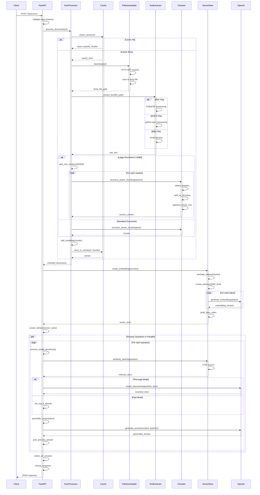
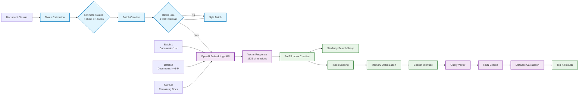
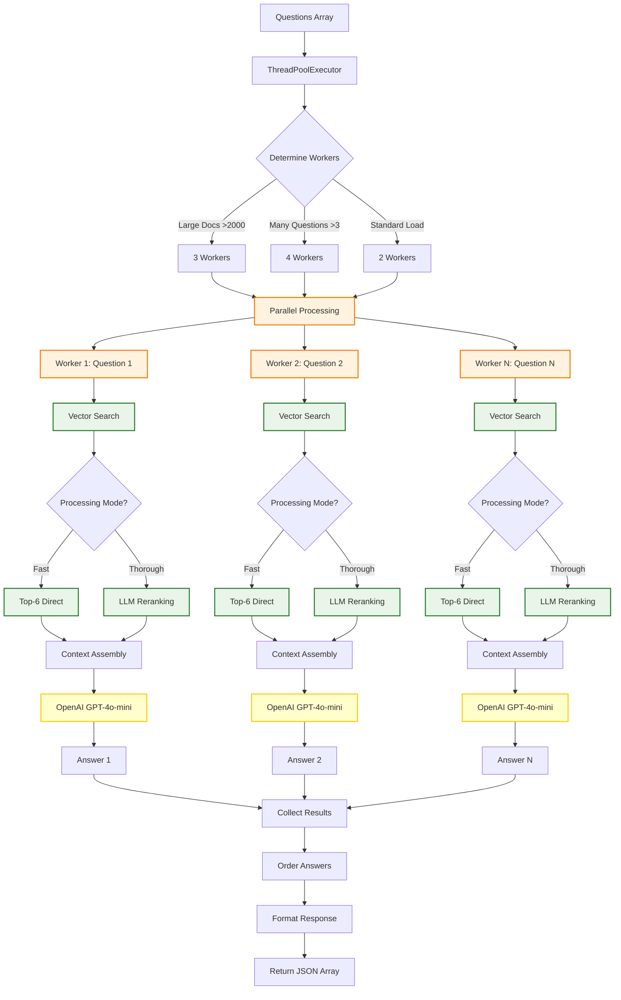
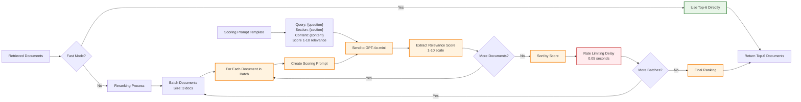
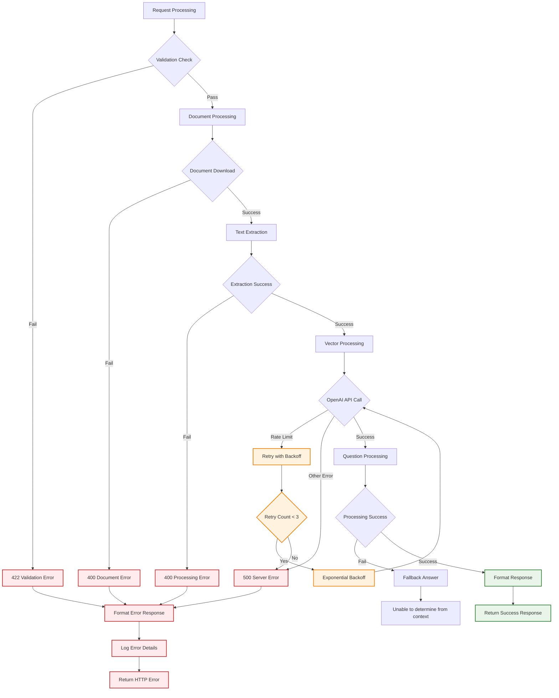
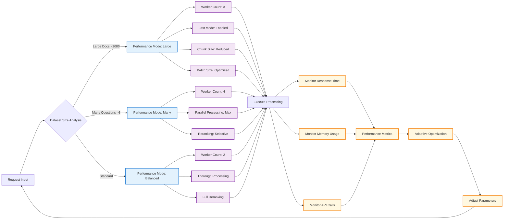
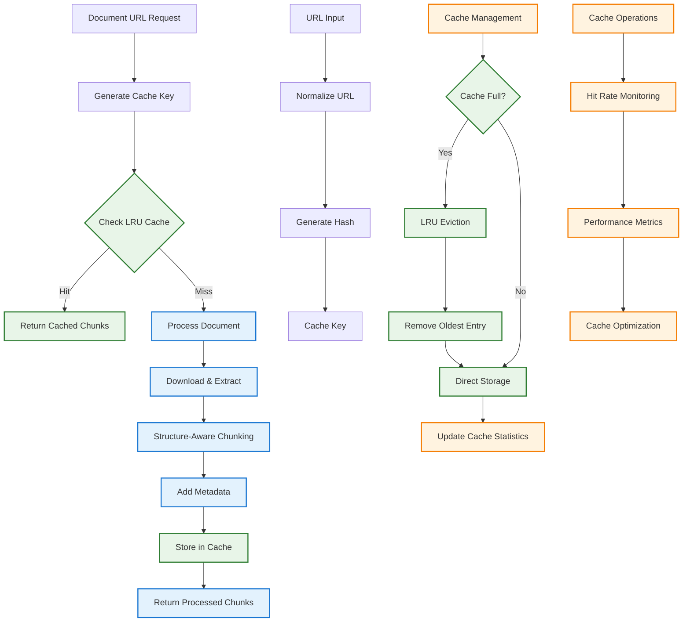
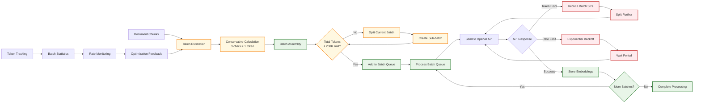

# Workflow and System Diagrams

This document contains detailed workflow diagrams and visual representations of the system architecture to help understand the complete document processing and question-answering pipeline.

## Complete System Workflow

```mermaid
graph TB
    %% Client Layer
    A[Client Application] --> B[HTTP POST Request]
    B --> C[FastAPI /hackrx/run Endpoint]
    
    %% Request Processing
    C --> D{Validate Input}
    D -->|Invalid| E[Return 422 Error]
    D -->|Valid| F[Extract Document URL & Questions]
    
    %% Document Processing Pipeline
    F --> G[Document Processor]
    G --> H{Check LRU Cache}
    H -->|Cache Hit| I[Use Cached Chunks]
    H -->|Cache Miss| J[Download Document]
    
    %% Document Download & Processing
    J --> K{Document Accessible?}
    K -->|No| L[Return 400 Error]
    K -->|Yes| M[Detect File Format]
    
    %% Format-Specific Processing
    M --> N{File Type?}
    N -->|PDF| O[PyMuPDF Text Extraction]
    N -->|DOCX| P[python-docx Extraction]
    N -->|EML| Q[Email Parser Extraction]
    N -->|Other| L
    
    %% Text Processing
    O --> R[Raw Text Content]
    P --> R
    Q --> R
    
    %% Size-Based Processing Strategy
    R --> S{Document Size Check}
    S -->|>1MB| T[Large Document Handler]
    S -->|≤1MB| U[Standard Processing]
    
    %% Large Document Processing
    T --> V[Split into 500KB Sections]
    V --> W[Process Each Section]
    W --> X[Structure-Aware Chunking]
    
    %% Standard Document Processing
    U --> X
    
    %% Chunking and Metadata
    X --> Y[Add Metadata to Chunks]
    Y --> Z[Store in Cache]
    Z --> I
    
    %% Vector Processing Pipeline
    I --> AA[Estimate Token Count]
    AA --> BB[Create Embedding Batches]
    BB --> CC{Batch Size OK?}
    CC -->|Too Large| DD[Split into Sub-batches]
    CC -->|OK| EE[Generate OpenAI Embeddings]
    DD --> EE
    
    %% Vector Store Creation
    EE --> FF[Create FAISS Vector Store]
    FF --> GG[Build Search Index]
    
    %% Question Processing
    GG --> HH[Initialize Parallel Processing]
    HH --> II{Determine Processing Mode}
    II -->|Large Dataset| JJ[Fast Mode - Skip Reranking]
    II -->|Small Dataset| KK[Thorough Mode - With Reranking]
    
    %% Parallel Question Processing
    JJ --> LL[Process Questions in Parallel]
    KK --> LL
    
    %% Individual Question Processing
    LL --> MM[For Each Question:]
    MM --> NN[Vector Similarity Search]
    NN --> OO[Retrieve Top-K Documents]
    OO --> PP{Reranking Mode?}
    PP -->|Fast| QQ[Use Top 6 Directly]
    PP -->|Thorough| RR[LLM-Based Reranking]
    
    %% Context Assembly
    QQ --> SS[Assemble Context]
    RR --> SS
    SS --> TT[Create Prompt with Context]
    
    %% Answer Generation
    TT --> UU[Send to OpenAI GPT-4o-mini]
    UU --> VV[Receive Generated Answer]
    VV --> WW[Post-process Answer]
    WW --> XX[Optimize Length & Format]
    
    %% Response Assembly
    XX --> YY[Collect All Answers]
    YY --> ZZ[Format JSON Response]
    ZZ --> AAA[Return to Client]
    
    %% Error Handling
    L --> BBB[Error Handler]
    E --> BBB
    BBB --> CCC[Log Error]
    CCC --> DDD[Return Error Response]
    
    %% Styling
    classDef errorClass fill:#ffcccc,stroke:#ff6666,stroke-width:2px
    classDef processClass fill:#cceeff,stroke:#0066cc,stroke-width:2px
    classDef cacheClass fill:#ccffcc,stroke:#00cc00,stroke-width:2px
    classDef aiClass fill:#ffffcc,stroke:#ffcc00,stroke-width:2px
    
    class E,L,BBB,CCC,DDD errorClass
    class G,X,Y,AA,BB,FF,GG,HH,LL,NN,SS,TT processClass
    class H,I,Z cacheClass
    class EE,UU,VV,RR aiClass
```

## Document Processing Detailed Flow

## Vector Processing Pipeline

## Question Processing Architecture

## Reranking Process Flow

## Error Handling Flow

## Performance Optimization Flow

## Caching Strategy

## Token Management System

These diagrams provide a comprehensive visual understanding of the entire system workflow, from initial request processing through document handling, vector processing, question answering, and response generation. Each diagram focuses on specific aspects of the system to help developers and users understand the complex interactions and optimizations built into the system.